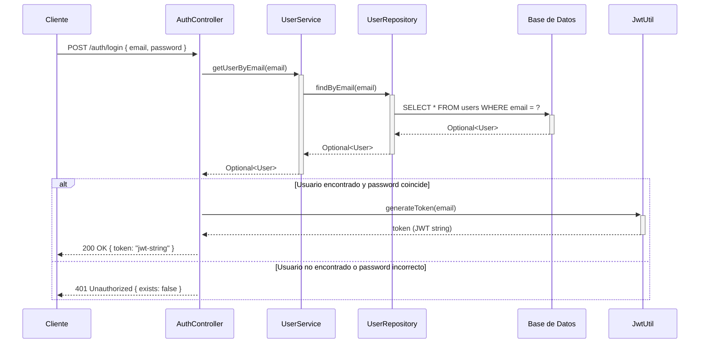
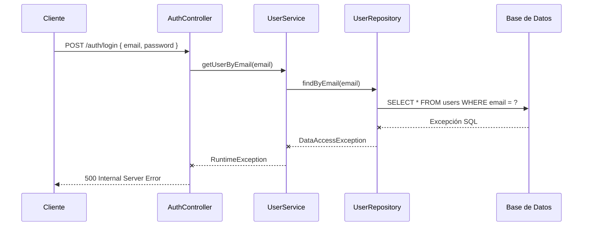
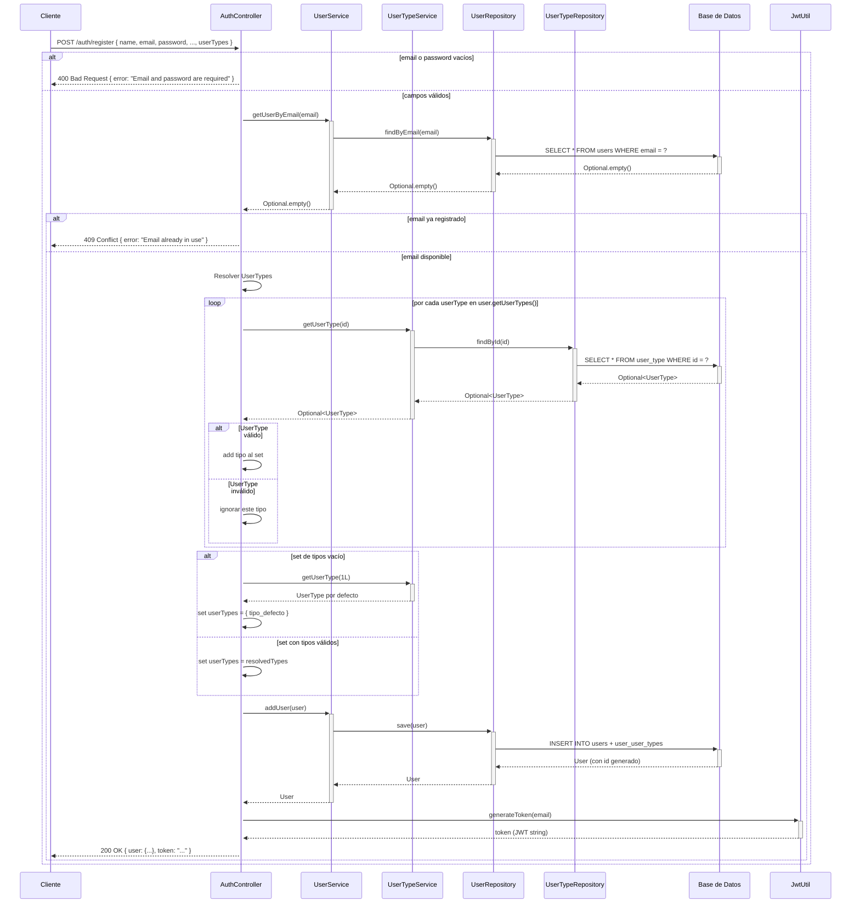

## POST /auth/login — Flujo exitoso

```mermaid
sequenceDiagram
    participant Cliente
    participant AuthController
    participant UserService
    participant UserRepository
    participant DB as Base de Datos
    participant JwtUtil

    Cliente->>+AuthController: POST /auth/login { email, password }
    AuthController->>+UserService: getUserByEmail(email)
    UserService->>+UserRepository: findByEmail(email)
    UserRepository->>+DB: SELECT * FROM users WHERE email = ?
    DB-->>-UserRepository: Optional<User>
    UserRepository-->>-UserService: Optional<User>
    UserService-->>-AuthController: Optional<User>

    alt Usuario encontrado y password coincide
        AuthController->>+JwtUtil: generateToken(email)
        JwtUtil-->>-AuthController: token (JWT string)
        AuthController-->>Cliente: 200 OK { token: "jwt-string" }
    else Usuario no encontrado o password incorrecto
        AuthController-->>Cliente: 401 Unauthorized { exists: false }
    end
```

## POST /auth/login — Flujo alternativo: error de base de datos

```mermaid
sequenceDiagram
    participant Cliente
    participant AuthController
    participant UserService
    participant UserRepository
    participant DB as Base de Datos

    Cliente->>AuthController: POST /auth/login { email, password }
    AuthController->>UserService: getUserByEmail(email)
    UserService->>UserRepository: findByEmail(email)
    UserRepository->>DB: SELECT * FROM users WHERE email = ?
    DB--xUserRepository: Excepción SQL
    UserRepository--xUserService: DataAccessException
    UserService--xAuthController: RuntimeException
    AuthController-->>Cliente: 500 Internal Server Error
```

## POST /auth/register — Flujo exitoso

```mermaid
sequenceDiagram
    participant Cliente
    participant AuthController
    participant UserService
    participant UserTypeService
    participant UserRepository
    participant UserTypeRepository
    participant DB as Base de Datos
    participant JwtUtil

    Cliente->>+AuthController: POST /auth/register { name, email, password, ..., userTypes }

    alt email o password vacíos
        AuthController-->>Cliente: 400 Bad Request { error: "Email and password are required" }
    else campos válidos
        AuthController->>+UserService: getUserByEmail(email)
        UserService->>+UserRepository: findByEmail(email)
        UserRepository->>+DB: SELECT * FROM users WHERE email = ?
        DB-->>-UserRepository: Optional.empty()
        UserRepository-->>-UserService: Optional.empty()
        UserService-->>-AuthController: Optional.empty()

        alt email ya registrado
            AuthController-->>Cliente: 409 Conflict { error: "Email already in use" }
        else email disponible
            AuthController->>AuthController: Resolver UserTypes

            loop por cada userType en user.getUserTypes()
                AuthController->>+UserTypeService: getUserType(id)
                UserTypeService->>+UserTypeRepository: findById(id)
                UserTypeRepository->>+DB: SELECT * FROM user_type WHERE id = ?
                DB-->>-UserTypeRepository: Optional<UserType>
                UserTypeRepository-->>-UserTypeService: Optional<UserType>
                UserTypeService-->>-AuthController: Optional<UserType>

                alt UserType válido
                    AuthController->>AuthController: add tipo al set
                else UserType inválido
                    AuthController->>AuthController: ignorar este tipo
                end
            end

            alt set de tipos vacío
                AuthController->>+UserTypeService: getUserType(1L)
                UserTypeService-->>-AuthController: UserType por defecto
                AuthController->>AuthController: set userTypes = { tipo_defecto }
            else set con tipos válidos
                AuthController->>AuthController: set userTypes = resolvedTypes
            end

            AuthController->>+UserService: addUser(user)
            UserService->>+UserRepository: save(user)
            UserRepository->>+DB: INSERT INTO users + user_user_types
            DB-->>-UserRepository: User (con id generado)
            UserRepository-->>-UserService: User
            UserService-->>-AuthController: User

            AuthController->>+JwtUtil: generateToken(email)
            JwtUtil-->>-AuthController: token (JWT string)
            AuthController-->>Cliente: 200 OK { user: {...}, token: "..." }
        end
    end
```
