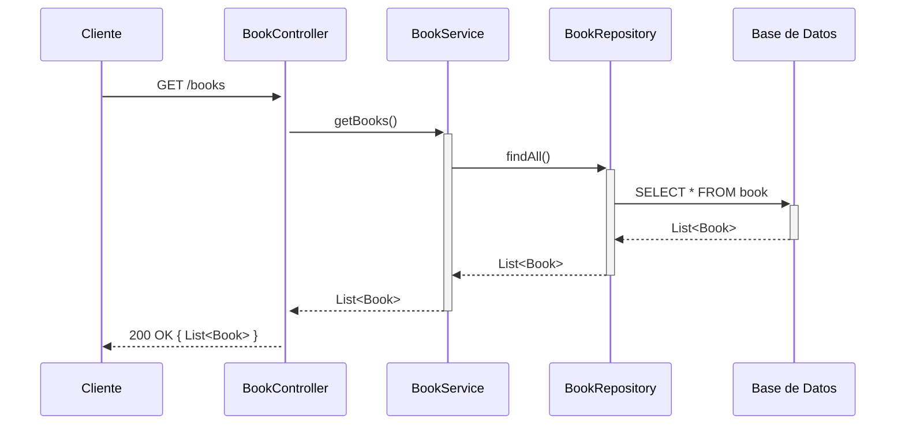
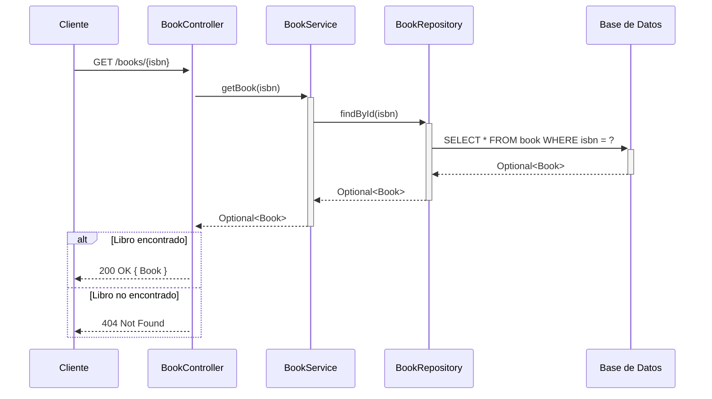
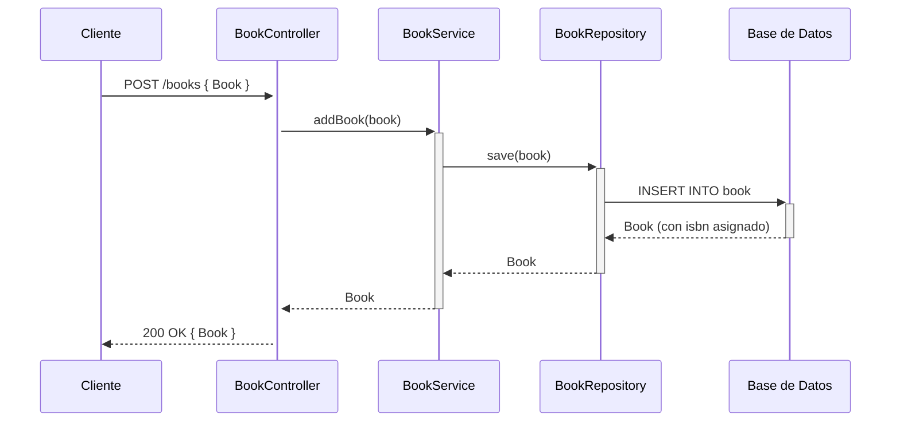
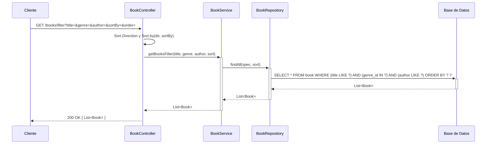

## GET /books — Listar todos los libros



## GET /books/{isbn} — Buscar libro por ISBN



## POST /books — Agregar nuevo libro



## PUT /books/{isbn} — Actualizar libro

```mermaid
sequenceDiagram
    participant Cliente
    participant BookController
    participant BookService
    participant BookRepository
    participant DB as Base de Datos

    Cliente->>+BookController: PUT /books/{isbn} { Book }
    BookController->>+BookService: updateBook(isbn, book)
    BookService->>+BookRepository: findById(isbn)
    BookRepository->>+DB: SELECT * FROM book WHERE isbn = ?
    DB-->>-BookRepository: Optional<Book>

    alt Libro encontrado
        BookService->>BookService: actualizar datos
        BookService->>+BookRepository: save(book)
        BookRepository->>+DB: UPDATE book SET ... WHERE isbn = ?
        DB-->>-BookRepository: Book actualizado
        BookRepository-->>-BookService: Book
        BookService-->>-BookController: Optional<Book>
        BookController-->>Cliente: 200 OK { Book }
    else Libro no encontrado
        BookService-->>-BookController: Optional.empty()
        BookController-->>Cliente: 404 Not Found
    end
```

## DELETE /books/{isbn} — Eliminar libro

```mermaid
sequenceDiagram
    participant Cliente
    participant BookController
    participant BookService
    participant BookRepository
    participant DB as Base de Datos

    Cliente->>+BookController: DELETE /books/{isbn}
    BookController->>+BookService: deleteBook(isbn)
    BookService->>+BookRepository: findById(isbn)
    BookRepository->>+DB: SELECT * FROM book WHERE isbn = ?
    DB-->>-BookRepository: Optional<Book>

    alt Libro encontrado
        BookService->>+BookRepository: delete(book)
        BookRepository->>+DB: DELETE FROM book WHERE isbn = ?
        DB-->>-BookRepository: OK
        BookRepository-->>-BookService: void
        BookService-->>-BookController: true
        BookController-->>Cliente: 204 No Content
    else Libro no encontrado
        BookService-->>-BookController: false
        BookController-->>Cliente: 404 Not Found
    end
```

## GET /books/filter — Filtrar libros


