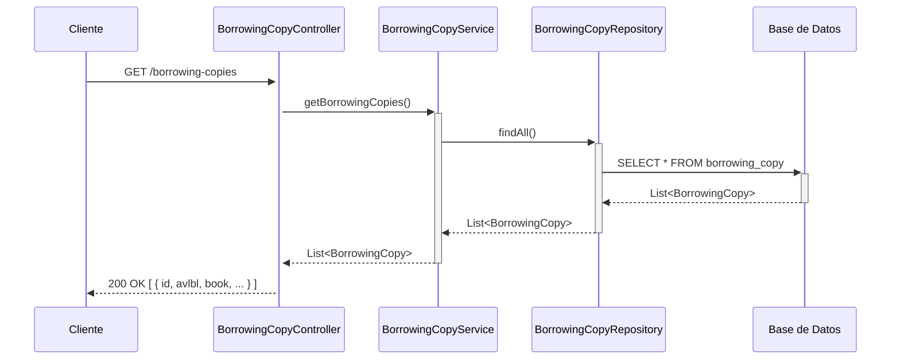
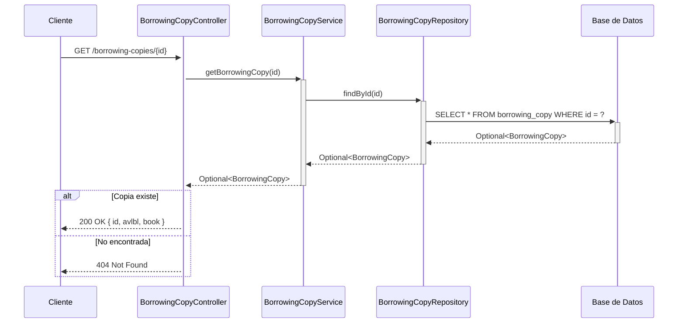
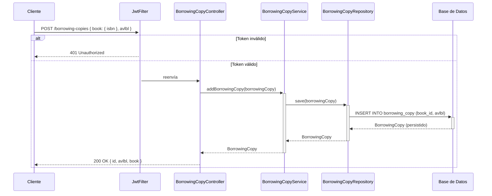
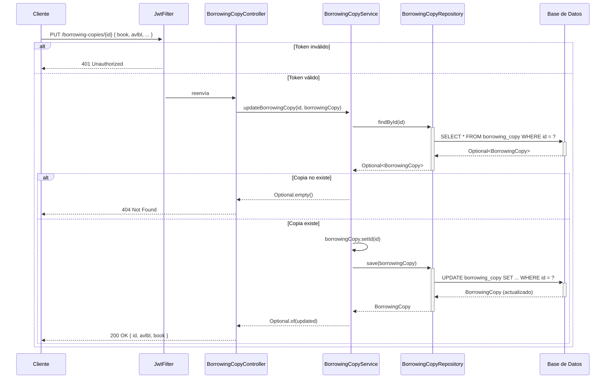
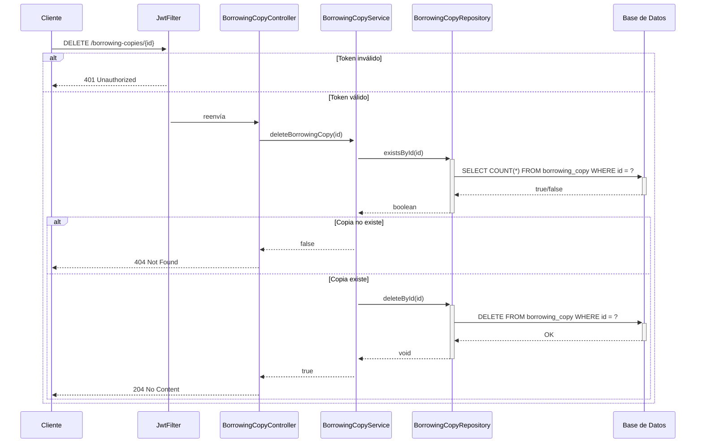
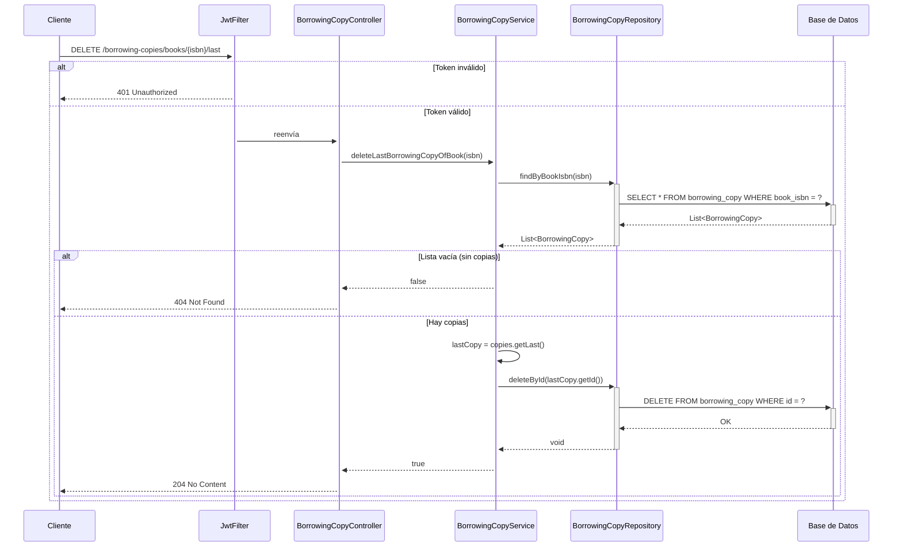

## GET /borrowing-copies — Listar todas las copias


## GET /borrowing-copies/{id} — Obtener copia por ID


## POST /borrowing-copies — Crear copia (autenticado)


## POST /borrowing-copies/books/{isbn} — Crear copia para libro (autenticado, AVALIABLE por defecto)

```mermaid
sequenceDiagram
    participant Cliente
    participant JwtFilter
    participant BCCtrl as BorrowingCopyController
    participant BCService as BorrowingCopyService
    participant BookRepo as BookRepository
    participant BCRepo as BorrowingCopyRepository
    participant DB as Base de Datos

    Cliente->>+JwtFilter: POST /borrowing-copies/books/{isbn}

    alt Token inválido
        JwtFilter-->>Cliente: 401 Unauthorized
    else Token válido
        JwtFilter->>+BCCtrl: reenvía
        BCCtrl->>+BCService: addBorrowingCopyOfBook(isbn)
        BCService->>+BookRepo: findById(isbn)
        BookRepo->>+DB: SELECT * FROM book WHERE isbn = ?
        DB-->>-BookRepo: Optional<Book>

        alt Libro no existe
            BookRepo-->>-BCService: Optional.empty()
            BCService-->>BCCtrl: Optional.empty()
            BCCtrl-->>Cliente: 404 Not Found
        else Libro existe
            BookRepo-->>-BCService: Book
            BCService->>BCService: new BorrowingCopy(book, AVALIABLE)
            BCService->>+BCRepo: save(borrowingCopy)
            BCRepo->>+DB: INSERT INTO borrowing_copy (book_id, avlbl)
            DB-->>-BCRepo: BorrowingCopy
            BCRepo-->>-BCService: BorrowingCopy
            BCService-->>BCCtrl: Optional.of(newCopy)
            BCCtrl-->>Cliente: 200 OK { id, avlbl: "AVALIABLE", book }
        end
    end

```
## PUT /borrowing-copies/{id} — Actualizar copia (autenticado, reemplazo completo)


## DELETE /borrowing-copies/{id} — Eliminar copia por ID (autenticado)


## DELETE /borrowing-copies/books/{isbn}/last — Eliminar última copia de un libro (autenticado)


