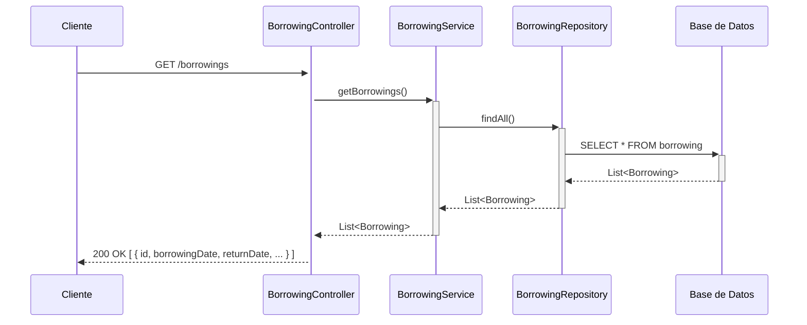
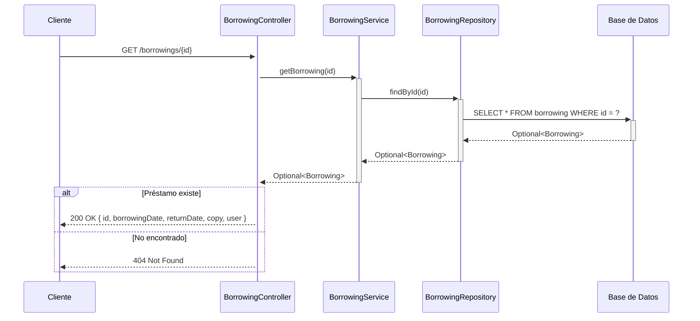
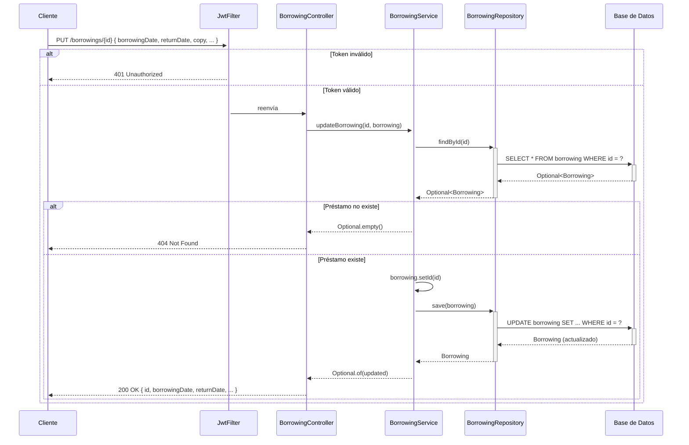
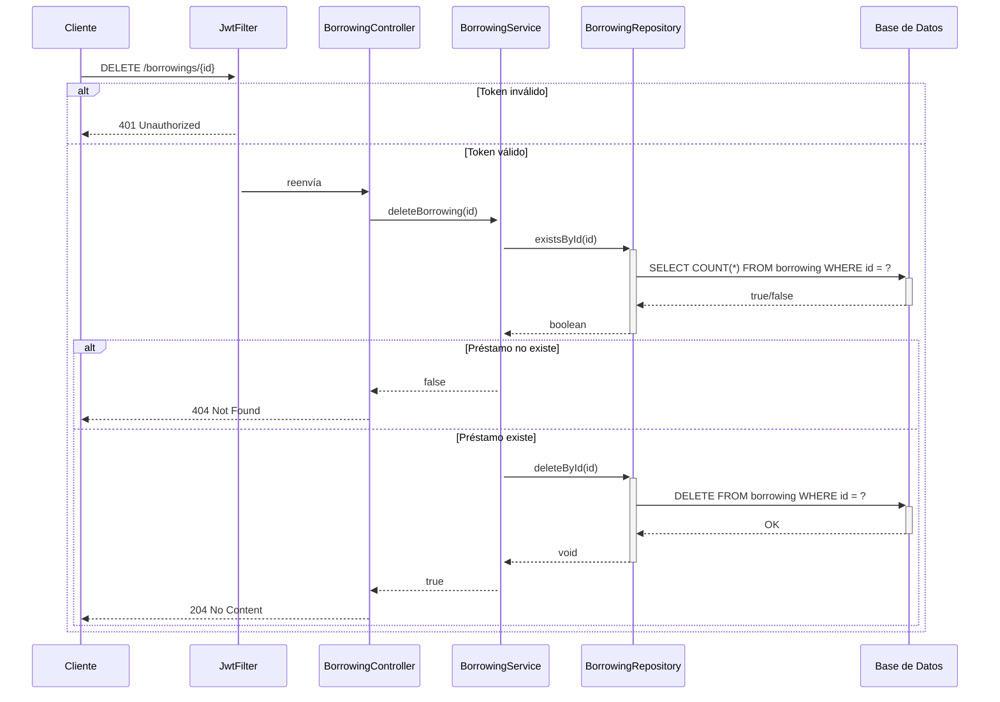

## GET /borrowings — Listar todos los préstamos


## GET /borrowings/{id} — Obtener préstamo por ID


## POST /borrowings — Crear préstamo (autenticado, resuelve usuario + copia)

```mermaid
sequenceDiagram
    participant Cliente
    participant JwtFilter
    participant BorrowingController
    participant UserService
    participant UserRepository
    participant BorrowingCopyService
    participant BorrowingCopyRepository
    participant BorrowingService
    participant BorrowingRepository
    participant DB as Base de Datos

    Cliente->>+JwtFilter: POST /borrowings { copy: { id }, borrowingDate, returnDate }

    alt Token inválido
        JwtFilter-->>Cliente: 401 Unauthorized
    else Token válido
        JwtFilter->>+BorrowingController: reenvía con Authentication (email)
        BorrowingController->>BorrowingController: auth.getName() → email
        BorrowingController->>+UserService: getUserByEmail(email)
        UserService->>+UserRepository: findByEmail(email)
        UserRepository->>+DB: SELECT * FROM users WHERE email = ?
        DB-->>-UserRepository: Optional<User>
        UserRepository-->>-UserService: Optional<User>
        UserService-->>-BorrowingController: User
        BorrowingController->>BorrowingController: borrowing.setUser(user)

        opt copy.id presente
            BorrowingController->>+BorrowingCopyService: getBorrowingCopy(copyId)
            BorrowingCopyService->>+BorrowingCopyRepository: findById(copyId)
            BorrowingCopyRepository->>+DB: SELECT * FROM borrowing_copy WHERE id = ?
            DB-->>-BorrowingCopyRepository: Optional<BorrowingCopy>
            BorrowingCopyRepository-->>-BorrowingCopyService: Optional<BorrowingCopy>

            alt Copia existe
                BorrowingCopyService-->>-BorrowingController: BorrowingCopy
                BorrowingController->>BorrowingController: borrowing.setCopy(copy)
            else Copia no existe
                BorrowingCopyService-->>-BorrowingController: null
                BorrowingController->>BorrowingController: copy = null
            end
        end

        BorrowingController->>+BorrowingService: addBorrowing(borrowing)
        BorrowingService->>+BorrowingRepository: save(borrowing)
        BorrowingRepository->>+DB: INSERT INTO borrowing
        DB-->>-BorrowingRepository: Borrowing (persistido)
        BorrowingRepository-->>-BorrowingService: Borrowing
        BorrowingService-->>-BorrowingController: Borrowing
        BorrowingController-->>Cliente: 200 OK { id, borrowingDate, returnDate, copy, user }
    end

```
## PUT /borrowings/{id} — Actualizar préstamo (autenticado, reemplazo completo)


## DELETE /borrowings/{id} — Eliminar préstamo (autenticado)


