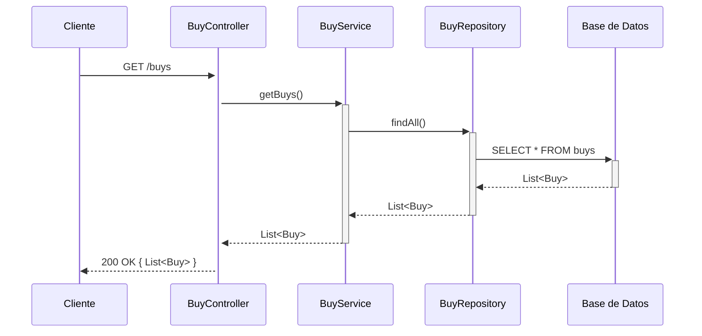
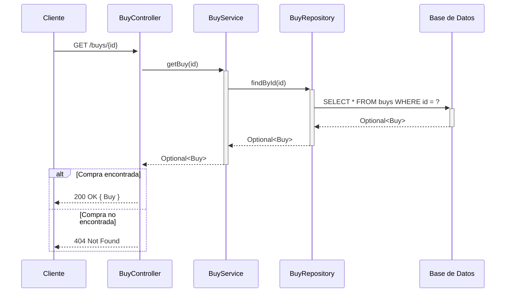
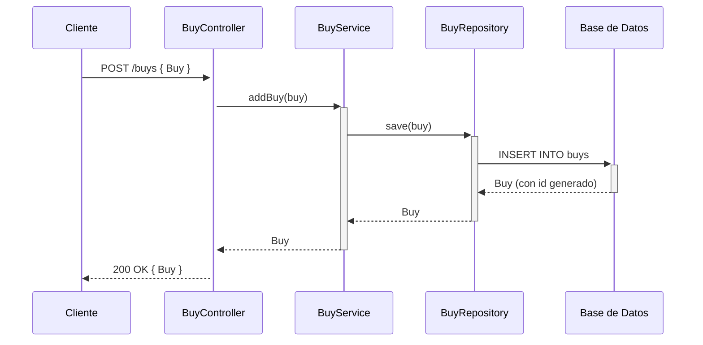

## GET /buys — Listar todas las compras



## GET /buys/{id} — Buscar compra por ID



## POST /buys — Agregar nueva compra



## PUT /buys/{id} — Actualizar compra

```mermaid
sequenceDiagram
    participant Cliente
    participant BuyController
    participant BuyService
    participant BuyRepository
    participant DB as Base de Datos

    Cliente->>+BuyController: PUT /buys/{id} { Buy }
    BuyController->>+BuyService: updateBuy(id, buy)
    BuyService->>+BuyRepository: findById(id)
    BuyRepository->>+DB: SELECT * FROM buys WHERE id = ?
    DB-->>-BuyRepository: Optional<Buy>

    alt Compra encontrada
        BuyService->>BuyService: buy.setId(id)
        BuyService->>+BuyRepository: save(buy)
        BuyRepository->>+DB: UPDATE buys SET ... WHERE id = ?
        DB-->>-BuyRepository: Buy actualizado
        BuyRepository-->>-BuyService: Buy
        BuyService-->>-BuyController: Optional<Buy>
        BuyController-->>Cliente: 200 OK { Buy }
    else Compra no encontrada
        BuyService-->>-BuyController: Optional.empty()
        BuyController-->>Cliente: 404 Not Found
    end
```

## DELETE /buys/{id} — Eliminar compra

```mermaid
sequenceDiagram
    participant Cliente
    participant BuyController
    participant BuyService
    participant BuyRepository
    participant DB as Base de Datos

    Cliente->>+BuyController: DELETE /buys/{id}
    BuyController->>+BuyService: deleteBuy(id)
    BuyService->>+BuyRepository: existsById(id)
    BuyRepository->>+DB: SELECT COUNT(*) FROM buys WHERE id = ?
    DB-->>-BuyRepository: boolean

    alt Compra existe
        BuyService->>+BuyRepository: deleteById(id)
        BuyRepository->>+DB: DELETE FROM buys WHERE id = ?
        DB-->>-BuyRepository: OK
        BuyRepository-->>-BuyService: void
        BuyService-->>-BuyController: true
        BuyController-->>Cliente: 204 No Content
    else Compra no encontrada
        BuyService-->>-BuyController: false
        BuyController-->>Cliente: 404 Not Found
    end
```
