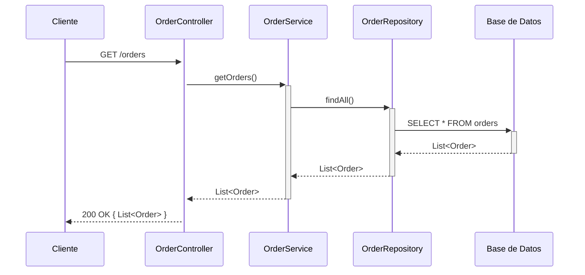
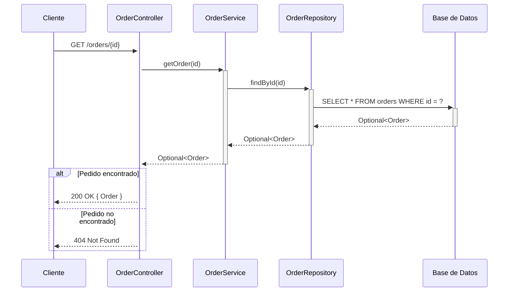
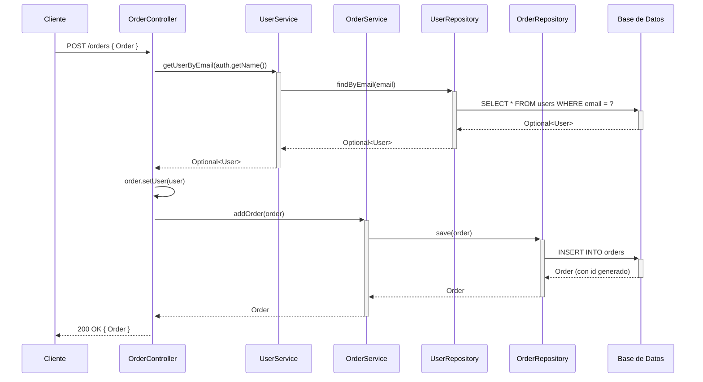

## GET /orders — Listar todos los pedidos



## GET /orders/{id} — Buscar pedido por ID



## POST /orders — Crear nuevo pedido



## PUT /orders/{id} — Actualizar pedido

```mermaid
sequenceDiagram
    participant Cliente
    participant OrderController
    participant OrderService
    participant OrderRepository
    participant DB as Base de Datos

    Cliente->>+OrderController: PUT /orders/{id} { Order }
    OrderController->>+OrderService: updateOrder(id, order)
    OrderService->>+OrderRepository: findById(id)
    OrderRepository->>+DB: SELECT * FROM orders WHERE id = ?
    DB-->>-OrderRepository: Optional<Order>

    alt Pedido encontrado
        OrderService->>OrderService: order.setId(id)
        OrderService->>+OrderRepository: save(order)
        OrderRepository->>+DB: UPDATE orders SET ... WHERE id = ?
        DB-->>-OrderRepository: Order actualizado
        OrderRepository-->>-OrderService: Order
        OrderService-->>-OrderController: Optional<Order>
        OrderController-->>Cliente: 200 OK { Order }
    else Pedido no encontrado
        OrderService-->>-OrderController: Optional.empty()
        OrderController-->>Cliente: 404 Not Found
    end
```

## DELETE /orders/{id} — Eliminar pedido

```mermaid
sequenceDiagram
    participant Cliente
    participant OrderController
    participant OrderService
    participant OrderRepository
    participant DB as Base de Datos

    Cliente->>+OrderController: DELETE /orders/{id}
    OrderController->>+OrderService: deleteOrder(id)
    OrderService->>+OrderRepository: existsById(id)
    OrderRepository->>+DB: SELECT COUNT(*) FROM orders WHERE id = ?
    DB-->>-OrderRepository: boolean

    alt Pedido existe
        OrderService->>+OrderRepository: deleteById(id)
        OrderRepository->>+DB: DELETE FROM orders WHERE id = ?
        DB-->>-OrderRepository: OK
        OrderRepository-->>-OrderService: void
        OrderService-->>-OrderController: true
        OrderController-->>Cliente: 204 No Content
    else Pedido no encontrado
        OrderService-->>-OrderController: false
        OrderController-->>Cliente: 404 Not Found
    end
```
