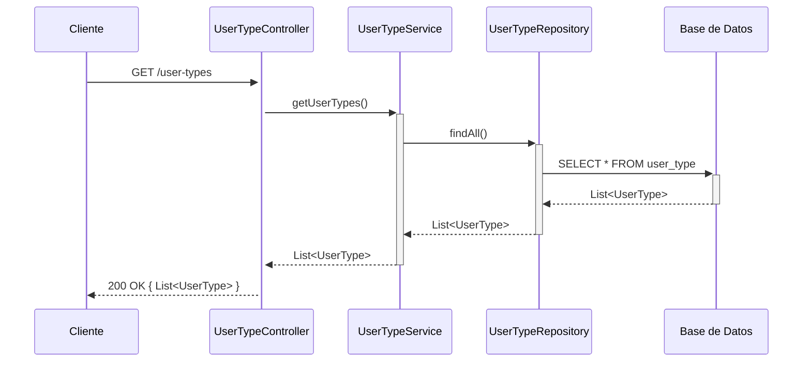
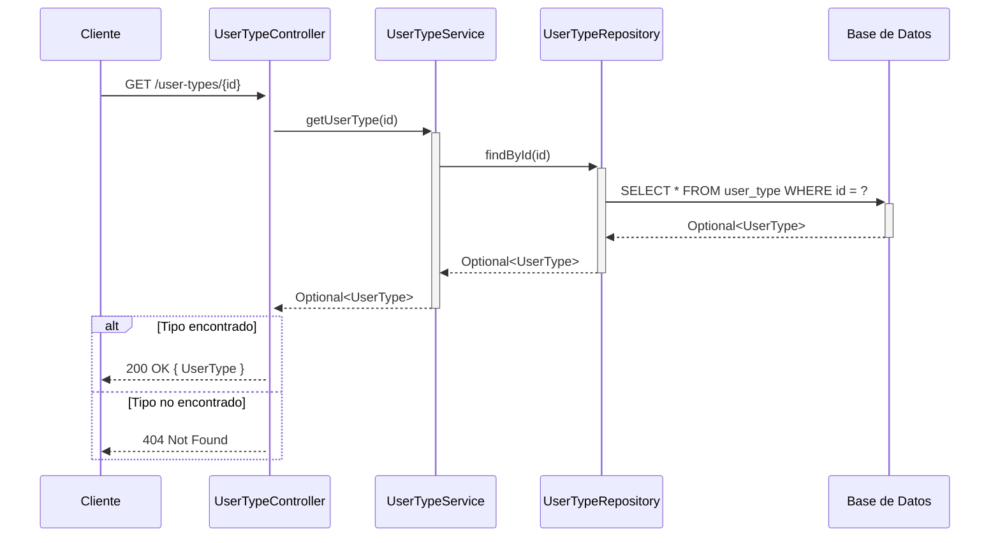
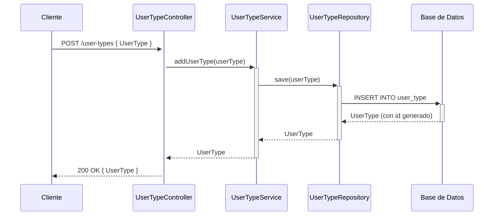

## GET /user-types — Listar todos los tipos de usuario



## GET /user-types/{id} — Buscar tipo de usuario por ID



## POST /user-types — Agregar nuevo tipo de usuario



## PUT /user-types/{id} — Actualizar tipo de usuario

```mermaid
sequenceDiagram
    participant Cliente
    participant UserTypeController
    participant UserTypeService
    participant UserTypeRepository
    participant DB as Base de Datos

    Cliente->>+UserTypeController: PUT /user-types/{id} { UserType }
    UserTypeController->>+UserTypeService: updateUserType(id, userType)
    UserTypeService->>+UserTypeRepository: findById(id)
    UserTypeRepository->>+DB: SELECT * FROM user_type WHERE id = ?
    DB-->>-UserTypeRepository: Optional<UserType>

    alt Tipo encontrado
        UserTypeService->>UserTypeService: userType.setId(id)
        UserTypeService->>+UserTypeRepository: save(userType)
        UserTypeRepository->>+DB: UPDATE user_type SET ... WHERE id = ?
        DB-->>-UserTypeRepository: UserType actualizado
        UserTypeRepository-->>-UserTypeService: UserType
        UserTypeService-->>-UserTypeController: Optional<UserType>
        UserTypeController-->>Cliente: 200 OK { UserType }
    else Tipo no encontrado
        UserTypeService-->>-UserTypeController: Optional.empty()
        UserTypeController-->>Cliente: 404 Not Found
    end
```

## DELETE /user-types/{id} — Eliminar tipo de usuario

```mermaid
sequenceDiagram
    participant Cliente
    participant UserTypeController
    participant UserTypeService
    participant UserTypeRepository
    participant DB as Base de Datos

    Cliente->>+UserTypeController: DELETE /user-types/{id}
    UserTypeController->>+UserTypeService: deleteUserType(id)
    UserTypeService->>+UserTypeRepository: existsById(id)
    UserTypeRepository->>+DB: SELECT COUNT(*) FROM user_type WHERE id = ?
    DB-->>-UserTypeRepository: boolean

    alt Tipo existe
        UserTypeService->>+UserTypeRepository: deleteById(id)
        UserTypeRepository->>+DB: DELETE FROM user_type WHERE id = ?
        DB-->>-UserTypeRepository: OK
        UserTypeRepository-->>-UserTypeService: void
        UserTypeService-->>-UserTypeController: true
        UserTypeController-->>Cliente: 204 No Content
    else Tipo no encontrado
        UserTypeService-->>-UserTypeController: false
        UserTypeController-->>Cliente: 404 Not Found
    end
```
