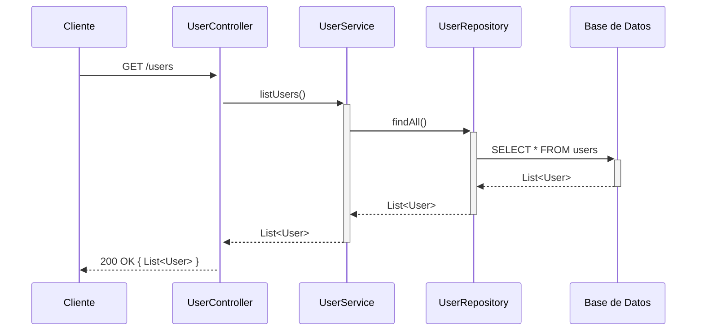
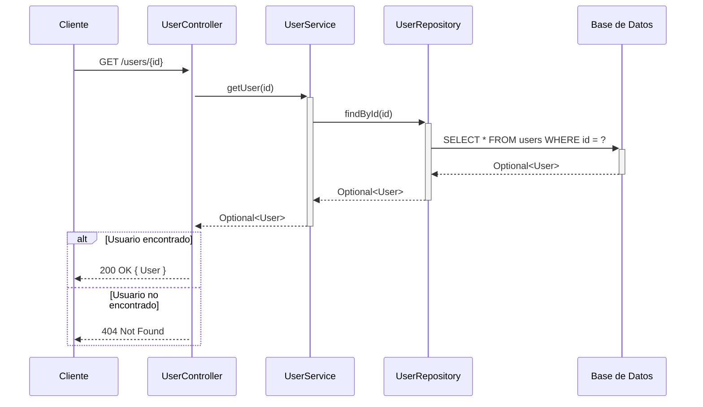
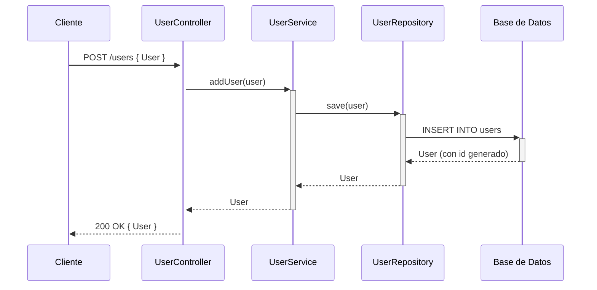

## GET /users — Listar todos los usuarios



## GET /users/{id} — Buscar usuario por ID



## POST /users — Agregar nuevo usuario



## PUT /users/{id} — Actualizar usuario

```mermaid
sequenceDiagram
    participant Cliente
    participant UserController
    participant UserService
    participant UserRepository
    participant DB as Base de Datos

    Cliente->>+UserController: PUT /users/{id} { User }
    UserController->>+UserService: updateUser(id, user)
    UserService->>+UserRepository: findById(id)
    UserRepository->>+DB: SELECT * FROM users WHERE id = ?
    DB-->>-UserRepository: Optional<User>

    alt Usuario encontrado
        UserService->>UserService: actualizar name, password, phone, address, city, state, country, postalCode
        UserService->>+UserRepository: save(existing)
        UserRepository->>+DB: UPDATE users SET ... WHERE id = ?
        DB-->>-UserRepository: User actualizado
        UserRepository-->>-UserService: User
        UserService-->>-UserController: Optional<User>
        UserController-->>Cliente: 200 OK { User }
    else Usuario no encontrado
        UserService-->>-UserController: Optional.empty()
        UserController-->>Cliente: 404 Not Found
    end
```

## DELETE /users/{id} — Eliminar usuario

```mermaid
sequenceDiagram
    participant Cliente
    participant UserController
    participant UserService
    participant UserRepository
    participant DB as Base de Datos

    Cliente->>+UserController: DELETE /users/{id}
    UserController->>+UserService: deleteUser(id)
    UserService->>+UserRepository: findById(id)
    UserRepository->>+DB: SELECT * FROM users WHERE id = ?
    DB-->>-UserRepository: Optional<User>

    alt Usuario encontrado
        UserService->>+UserRepository: delete(user)
        UserRepository->>+DB: DELETE FROM users WHERE id = ?
        DB-->>-UserRepository: OK
        UserRepository-->>-UserService: void
        UserService-->>-UserController: true
        UserController-->>Cliente: 204 No Content
    else Usuario no encontrado
        UserService-->>-UserController: false
        UserController-->>Cliente: 404 Not Found
    end
```
